# Accounting Automation Flowcharts

## Visual Workflow Diagrams for All 10 Core Zaps

**Version:** 1.0.0
**Created:** October 21, 2025
**Purpose:** Visual representation of each automation workflow

---

## ZAP #1: Invoice & Receipt Tracking

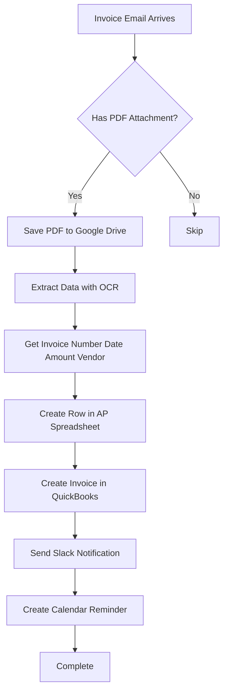

**Time saved:** 95 minutes per week

---

## ZAP #2: Expense Tracking by Project

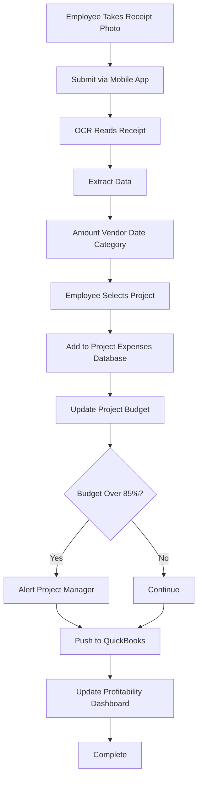

**Time saved:** 285 minutes per week

---

## ZAP #3: Accounts Receivable Progress Billing

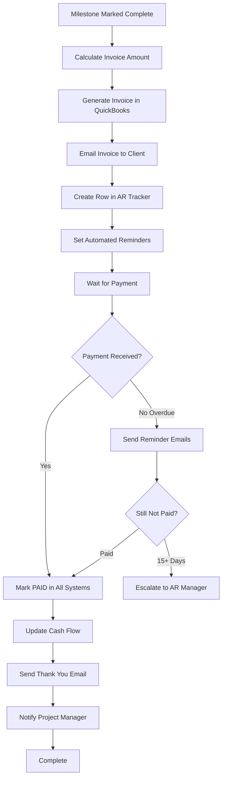

**Time saved:** 290 minutes per month

---

## ZAP #4: Vendor Payments Accounts Payable

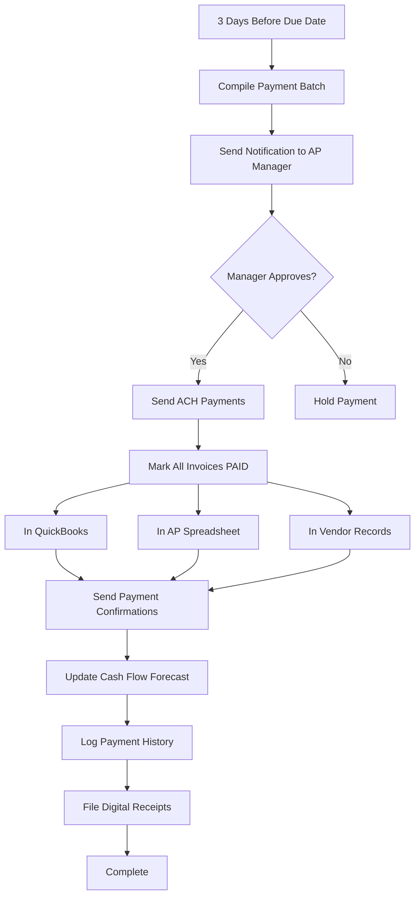

**Time saved:** 295 minutes per week

---

## ZAP #5: Subcontractor Management

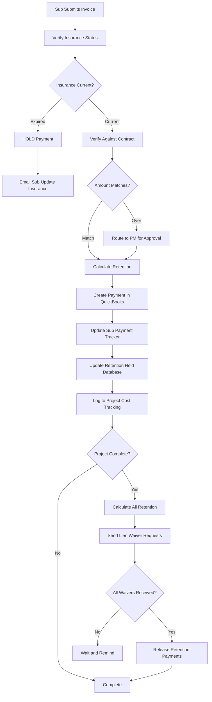

**Time saved:** 270 minutes per week

---

## ZAP #6: Monthly Financial Reporting

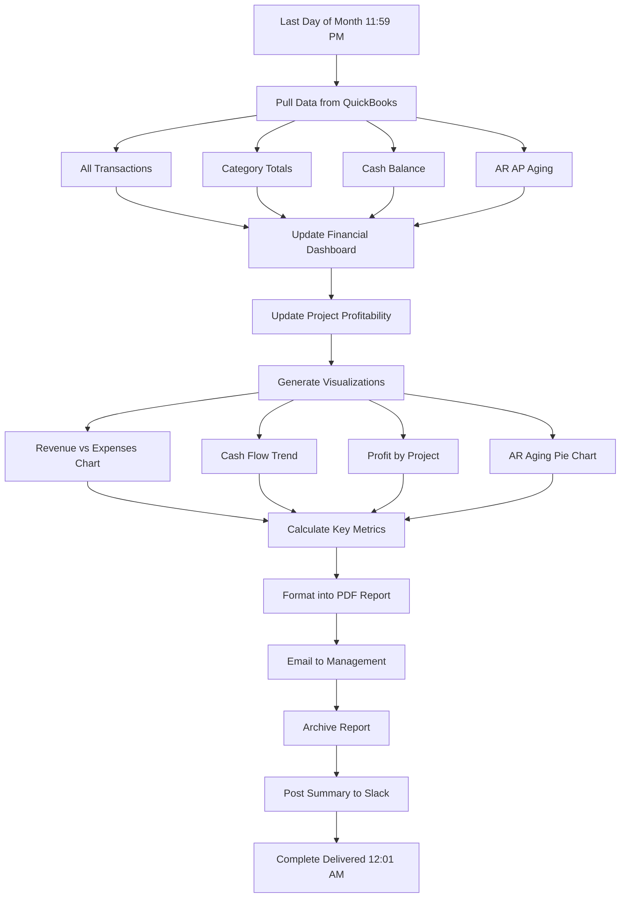

**Time saved:** 16-24 hours per month

---

## ZAP #7: Receipt Management

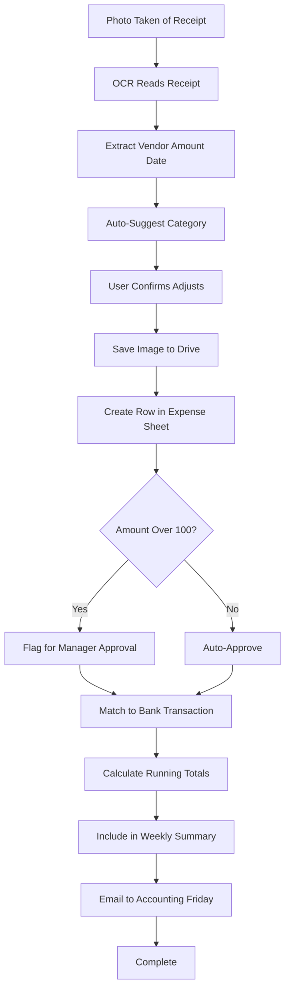

**Time saved:** 142.5 minutes per month3

---

## ZAP #8: Bank Reconciliation

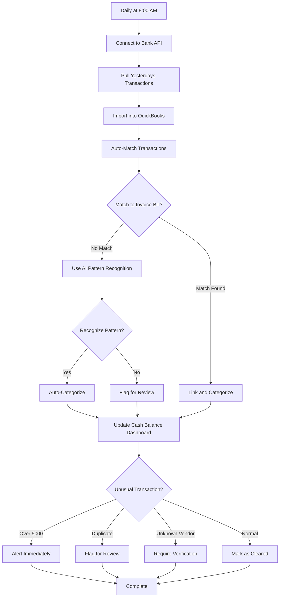

**Time saved:** 3.5-5.5 hours per month

---

## ZAP #9: Time Tracking to Billing

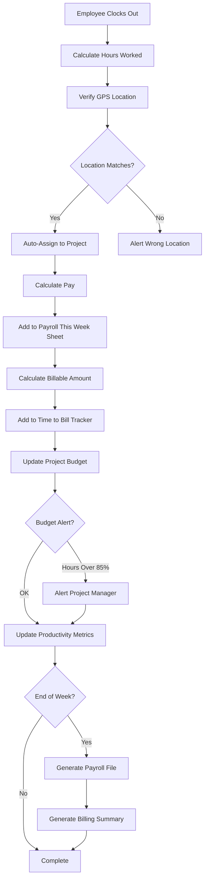

**Time saved:** 160+ hours annually

---

## ZAP #10: Purchase Order Tracking

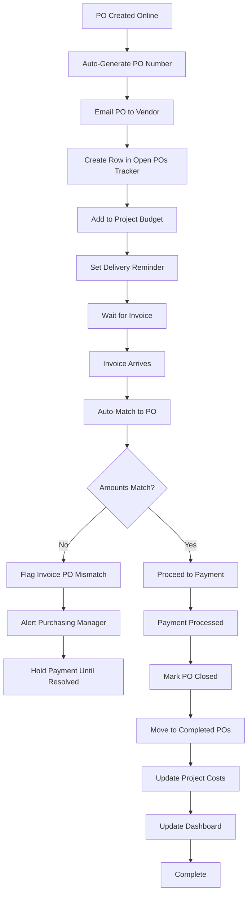

**Time saved:** 115 minutes per week

---

## Summary: All 10 Zaps Connected

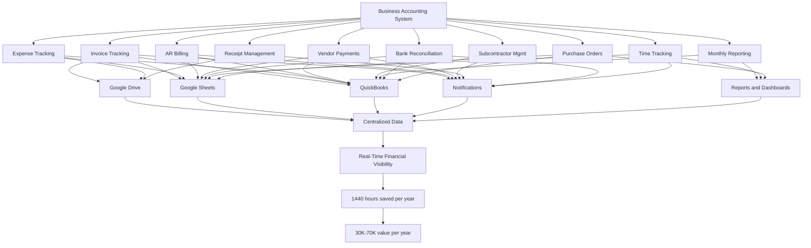

---

## Complexity Levels

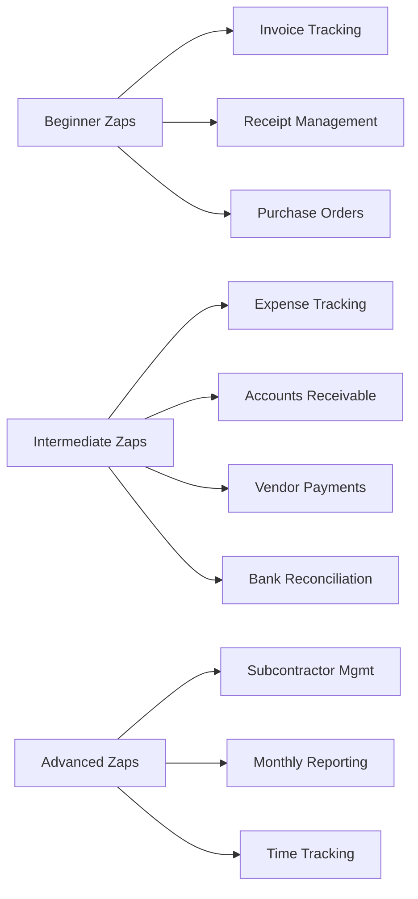

---

**Document Version:** 1.0.0
**Created:** October 21, 2025
**View in VS Code:** Use Mermaid preview extension to see flowcharts

**Note:** Removed special characters and emojis for better compatibility with Mermaid rendering engines.
